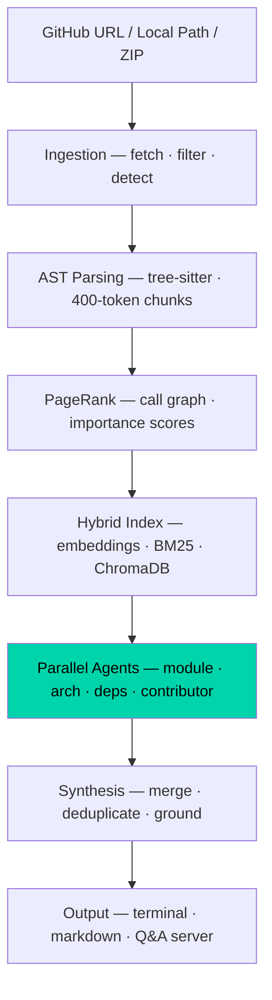

<div align="center">

# KairoRM

**A code intelligence engine that builds a living map of any codebase.**


<!-- demo GIF — record with vhs or terminalizer, drop in docs/demo.gif -->
<!--  -->

</div>

Point KairoRM at any GitHub repo and it returns a full architecture breakdown, module guide, contributor onboarding doc, and a live Q&A interface. Unlike RAG-based repo chatbots, KairoRM builds an actual call graph, ranks every code chunk by PageRank importance, and routes specialist agents only what they need. The result is grounded, accurate intelligence — not hallucinated summaries.

## Table of Contents

- [How it works](#how-it-works)
- [Quickstart](#quickstart)
- [Output](#output)
- [LLM Backends](#llm-backends)
- [Architecture](#architecture)
- [Development](#development)

## How it works



The key difference from naive RAG: PageRank-ranked chunks mean agents see the most important code first, not just the most semantically similar.

## Quickstart

```bash
# install
pip install kairo-rm

# add your LLM key (Groq is free at console.groq.com)
echo "GROQ_API_KEY=your_key_here" > .env

# run on any repo
kairo map https://github.com/karpathy/micrograd
```

### Ask questions

```bash
curl -X POST http://localhost:8000/ask \
  -H "Content-Type: application/json" \
  -d '{"question": "how does backpropagation work in this codebase"}'
```

<details>
<summary>Response from the live server</summary>

Backpropagation in this codebase works as follows:

1. **Building the computation graph**: When you perform operations on `Value` objects, a computation graph is dynamically built. Each `Value` object represents a node in the graph, and its `_prev` attribute stores the previous nodes that were used to compute its value.

2. **Topological ordering**: When `backward` is called on a `Value` object, the graph is topologically ordered using a depth-first search (DFS) approach. This is done in the `build_topo` function, which traverses the graph and stores the nodes in a list `topo`.

3. **Applying the chain rule**: Once the graph is ordered, the `backward` method applies the chain rule to compute the gradients of each node. It starts from the output node and iterates backwards through the graph, calling the `_backward` method of each node. The `_backward` method updates the gradient of the current node based on the gradients of its children.

4. **Updating gradients**: The `_backward` method of each node updates its gradient based on the gradients of its children. For example, in the `__add__` method, the `_backward` method updates the gradients of the two input nodes by adding the gradient of the output node to their gradients.

Here's a simplified example of how backpropagation works in this codebase:

```python
a = Value(2.0)
b = Value(3.0)
c = a + b

# Build the computation graph:
# c <- a, b

c.backward()

# Topological ordering:
# [c, a, b]

# Apply the chain rule:
# c.grad = 1 (initial gradient)
# a.grad += c.grad
# b.grad += c.grad

print(a.grad)  # prints 1.0
print(b.grad)  # prints 1.0
```

In this example, the computation graph is built when we perform the addition operation `a + b`. When we call `backward` on `c`, the graph is topologically ordered, and the chain rule is applied to compute the gradients of `a` and `b`. The gradients of `a` and `b` are updated based on the gradient of `c`, which is initially set to 1.0.

</details>

## Output

Every run writes three files to `kairomap-output/<repo-name>/`:

| File | Contains |
| --- | --- |
| `architecture.md` | Full human-readable analysis — modules, entry points, architecture, contributor guide |
| `kairomap.json` | Structured JSON for programmatic use |
| `context.txt` | Compressed context, pipeable into other tools or LLMs |

A live Q&A server starts at `http://localhost:8000` — ask anything about the codebase.

## LLM Backends

| Backend | Set up | Used for | Cost |
| --- | --- | --- | --- |
| Groq (llama-3.3-70b-versatile) | `GROQ_API_KEY` in `.env` | Agents, synthesis, Q&A | Free tier |
| Gemini 2.5 Pro | `GEMINI_API_KEY` in `.env` | Fallback for all LLM calls | Free tier |
| sentence-transformers (MiniLM) | Automatic | Embeddings only | Always free, fully local |

Groq alone is enough. Gemini is the fallback. Embeddings always run locally.

## Architecture

Six layers, each with a single responsibility:

```
kairoRM/
├── ingestion/      # repo fetch, file filter (.gitignore + binary), language detect
├── parsing/        # tree-sitter AST, 400-token semantic chunks, PageRank on call graph
├── indexing/       # Gemini/MiniLM embeddings, ChromaDB, BM25+semantic hybrid retrieval
├── agents/         # four specialist agents via asyncio.gather (parallel, not sequential)
├── synthesis/      # merge agent outputs, deduplicate, grounding check, compress
└── output/         # rich terminal renderer, markdown/JSON export, FastAPI Q&A server
```

## Development

```bash
git clone https://github.com/yourusername/kairo-rm
cd kairo-rm
python -m venv .venv && source .venv/bin/activate
pip install -e ".[dev]"

# run tests
pytest

# lint
ruff check .
```

104 tests, zero external API calls in test suite — all LLM and network calls are mocked.

## Recording a demo GIF

```bash
# install vhs (charmbracelet.github.io/vhs)
brew install vhs

# record
vhs docs/demo.tape
```

Drop the output GIF into `docs/demo.gif` and uncomment the image tag in the header.

## License

MIT.
