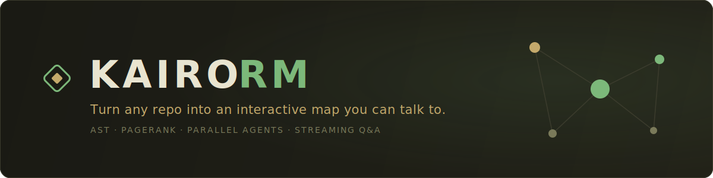
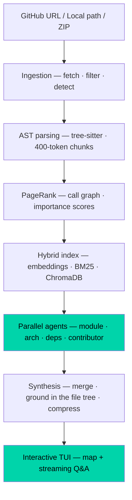

<div align="center">



&nbsp;


</div>

Point KairoRM at a GitHub repo or a local path. It parses the code into an AST, builds a
real **call graph**, ranks every chunk by **PageRank** importance, and dispatches four
specialist agents in parallel to produce an architecture breakdown, module guide, and
contributor onboarding. Then it drops you into a **keyboard-driven terminal console** —
a navigable codebase map beside a streaming Q&A chat. No browser, no leaving the terminal.

What makes the output trustworthy: the **module list comes from the real file tree** and
**circular dependencies come from the actual call graph** — not from the language model.
The LLM writes prose; the structure is grounded in the code.

## Table of contents

- [How it works](#how-it-works)
- [Quickstart](#quickstart)
- [The console](#the-console)
- [LLM backends & cost](#llm-backends--cost)
- [Architecture](#architecture)
- [Development](#development)

## How it works



The difference from a naive RAG chatbot: PageRank-ranked chunks mean the agents see the
most *important* code first, not just the most semantically similar — and the final map
is reconciled against the real directory structure so no module is ever dropped or invented.

## Quickstart

KairoRM isn't on PyPI yet — install from source (it's a small, self-contained Python tool):

```bash
git clone https://github.com/ShaanGS/KairoRM.git
cd KairoRM
python -m venv .venv && source .venv/bin/activate
pip install -e .

# add an LLM key — Groq is free at console.groq.com
echo "GROQ_API_KEY=your_key_here" > .env

# analyse a repo and open the console
kairo map https://github.com/karpathy/micrograd
```

Or use the Makefile (no venv activation needed):

```bash
make run SRC=https://github.com/karpathy/micrograd
make run                 # analyse the current directory
```

`kairo map` accepts a GitHub URL, a local path, or a `.zip`.

## The console

When the scan finishes, KairoRM opens an interactive terminal console:

- **Map pane** — architecture summary, modules and what each does, entry points,
  dependencies, and any circular-dependency warnings, all scrollable.
- **Chat pane** — ask anything about the codebase; answers **stream in token by token**,
  grounded in the actual retrieved code, with a count of the chunks used.
- **Keyboard-driven** — `Esc` to focus the prompt, `Ctrl+C` to quit.

Every run also writes to `kairomap-output/<repo>/`:

| File | Contains |
| --- | --- |
| `architecture.md` | Full human-readable analysis, with a mermaid dependency graph at the top (renders on GitHub) |
| `kairomap.json` | Structured analysis for programmatic use |
| `context.txt` | Compressed context, pipeable into other tools or LLMs |
| `architecture.mmd` | The module dependency graph as a standalone mermaid file |
| `architecture.dot` / `.png` | GraphViz dependency graph — PNG rendered if the `graphviz` binary is installed (`brew install graphviz`), skipped silently otherwise |

(When stdout isn't a TTY — piped or in CI — it prints a static report instead of the TUI.)

## LLM backends & cost

| Backend | Setup | Used for | Cost |
| --- | --- | --- | --- |
| Groq (`llama-3.3-70b-versatile`) | `GROQ_API_KEY` in `.env` | Agents, synthesis, Q&A | Free tier |
| Gemini (`gemini-2.5-flash`) | `GEMINI_API_KEY` in `.env` | Fallback for all LLM calls | Free tier |
| Gemini embeddings (`gemini-embedding-001`) → MiniLM | automatic | Chunk embeddings | Free / local |

One key is enough; the second is a fallback. Models are overridable via
`KAIRO_GROQ_MODEL`, `KAIRO_GEMINI_MODEL`, and `KAIRO_EMBED_MODEL`.

> **Heads-up on free tiers.** Free Groq/Gemini accounts have per-minute and per-day
> limits. KairoRM retries rate-limited calls with backoff and falls back across
> providers, but a very large repo (or many runs in a day) can still exhaust a free
> quota. For heavy use, a paid key is smoother.

## Architecture

Six layers, each with a single responsibility:

```
KairoRM/
├── ingestion/   # repo fetch, file filter (.gitignore + binary), language detect
├── parsing/     # tree-sitter AST, 400-token semantic chunks, PageRank on the call graph
├── indexing/    # Gemini/MiniLM embeddings, ChromaDB, BM25 + semantic hybrid retrieval
├── agents/      # four specialist agents via asyncio.gather (parallel), streaming dispatch
├── synthesis/   # merge agent outputs, ground in the file tree, compress
└── output/      # rich renderer, markdown/JSON export, interactive Textual TUI
```

Design notes: agents never receive the full codebase (only their retrieved chunks);
every LLM call has a provider fallback; agent outputs are `Result`-typed so one flaky
call never sinks the run; and hallucination-prone fields (modules, circular deps,
hotspots) are filled deterministically from the graph, not the model.

## Development

```bash
pip install -e ".[dev]"

make test     # run the suite (122 tests, all API/network calls mocked)
make lint     # ruff check
make fmt      # ruff format
```

## License

MIT.
